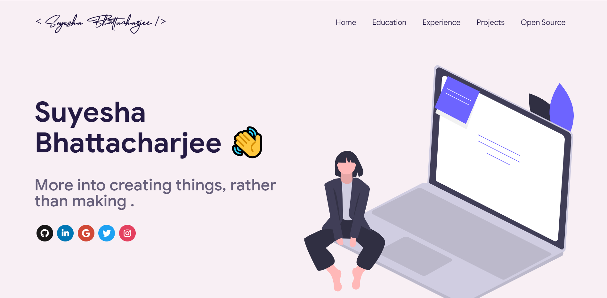

 
    </img>

# Sections 📑

✔️ Summary and About me\
✔️ Skills \
✔️ Open Source Projects Connected with Github\
✔️ Experience\
✔️ Education\

To view a live example, **[click here](https://suyesha07.github.io/portfolio/)**

# References 👏🏻

- Some Design and Implementation Ideas are taken from [Saad Pasta's Portfolio Project](https://github.com/saadpasta/developerFolio) and [Master Portfolio](https://github.com/ashutosh1919/masterPortfolio).
